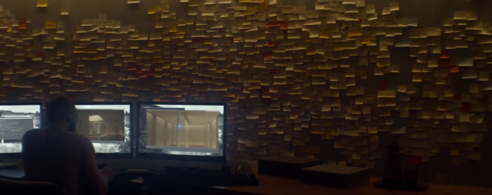

# Just Do The Work

I'm writing this post at the end of the first ever semester of my PhD studies (am I a grad student? always confused by this). The following writings will serve as a means to share the content I am digesting each day, ranging from personal curiosities to specific fields of my research interest. Doing this will hopefully help keep me sane and fill the void of not creating and sharing. Although it is not expected to reach any audience at all. But if you stumbled on this (I am curious how), enjoy or run away if the content scares or bores you.

To avoid writing all of my irrelevant and unrelated thoughts lets *just do the work*.

But before this – why the banner image? It shows deeply focused Nathan from the movie *Ex Machina* (2014). This is the state I want to see myself in every day – deeply focused, or, to be more precise, *locked in*.

## Status

After several weeks of *impostor syndrome*, from seeing literally everyone around me being on a much higher level, and *FOMO* from the feeling that I do not have a clear direction, I am stuck and missing all the cool research that is recently being published – after all of this, I think it has finally settled.

I love learning about artificial intelligence. I always did (read since I was approx. 15yo). I wanted to be part of the field, but I never found a specific area of interest (FOMO hits again). Interpretability and explainability in AI felt like a great compromise – I could study the principles, go really deep into understanding the black box models. And I fell in love with it in some sense, mostly thanks to the absolutely beautiful work of distill.pub and all of Chris Olah's work. I am very grateful for these.

Anyway, I gravitated to the very niche subfield called **concept-based interpretability**, where the goal is to understand model behavior with human-understandable concepts.

My PhD research is somewhat constrained to medical AI, specifically histology. There is supposedly a vast space for exploration, research areas, and new discoveries. I quickly learned that I must shift my focus to the transformer architecture and adapt my learning and research processes.

Although I've read multiple self-improvement books (which I generally hate), I've developed my own method that's slowly but surely starting to work (after all the struggles and failures). I learned about MIL, I learned about the sheer amount of publications, and I learned that there is always some Asian guy that thought of your ideas at least 3 years ago (and his name is probably Zhang). But that is okay. We cannot know anything, can we… (wish we could).

## Concept-based Interpretability

The main resources for studies are these four surveys (order based on when I got to them):

- [Self-eXplainable AI for Medical Image Analysis: A Survey and New Outlooks](https://arxiv.org/pdf/2410.02331) (Nov. 2024)
- [Concept-based Explainable Artificial Intelligence: A Survey](https://arxiv.org/pdf/2312.12936) (Dec. 2023)
- [Concept-Based Explanations in Computer Vision: Where Are We and Where Could We Go?](https://arxiv.org/pdf/2409.13456) (Sep. 2024)
- [From Neural Activations to Concepts: A Survey on Explaining Concepts in Neural Networks](https://arxiv.org/pdf/2310.11884) (May 2024)

Hopefully there are no more recent ones relevant to me. Wish me luck - if not anyone, than at least my future self. Now - just do the work.